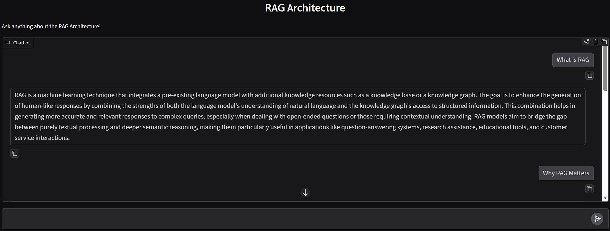
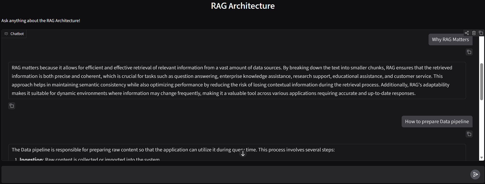
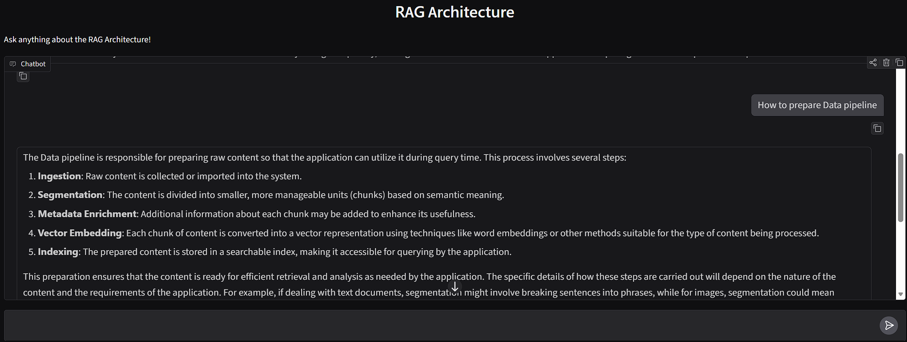

# **RAG Application 🤖**

An interactive **Retrieval-Augmented Generation (RAG)** application developed using 🦜🔗**LangChain, 🤗 Hugging Face**, and 🌲 **ChromaDB**. This repository provides a complete hands-on pipeline illustrating how modern RAG systems process static documents to deliver contextually accurate responses via a sleek chatbot interface.
---

## **🏗️ Architecture Workflow**

The system operates based on the structural flow depicted in the project workflow:


---

## **1. 📂 The Ingestion Pipeline (Green Path)**
* Data Sources: Raw unstructured content (PDF, DOC, XLS, TXT) is brought into the application.
* Text Splitting: Large text files are tokenized and broken down into smaller, semantically distinct chunks.
* Vector Embeddings: Text chunks are processed through an Embedding Model to convert raw prose into numerical **Data Vector Embeddings**.
* Vector Store Storage: These embeddings are indexed and saved directly into ChromaDB for rapid mathematical similarity lookups.

## **2. ⚡ The Retrieval & Generation Pipeline (Red/Purple Path)**
* Query Transformation: When a user asks a question, it passes through the same embedding model to create a dynamic **Query Vector Embedding**.
* Similarity Search: The system runs a vector search matching the user's query vector against indexed document vectors inside the database.
* Augmented Context: The top *k* matching **Retrieved Chunks** are extracted to serve as the ground-truth context.
* LLM Generation: The retrieved text chunks are packaged alongside system instructions and the original query into a refined prompt layout, which the LLM reads to generate a hallucination-minimized **Response.**
---

## **🛠️ Tech Stack & Key Components**
* 🦜🔗 Orchestration Framework: LangChain / LangChain Classic
* 🚀 Large Language Model (LLM): **Qwen/Qwen2.5-1.5B-Instruct** (Hosted via Hugging Face Pipeline wrappers)
* 🧠 Text Embedding Model: **sentence-transformers/all-MiniLM-L6-v2**
* 🗄️ Vector Store Database: ChromaDB
* 📄 Document Loader: PyPDFLoader
* 🎨 User Interface: Gradio ChatInterface
---

## **📸 Application Screenshots**




---

## **🚀 Getting Started on Google Colab**

This notebook is optimized to run seamlessly on a Google Colab free-tier Tesla T4 GPU execution environment. Follow these steps to set it up:

**1. 📓 Open in Google Colab**
* Upload the **RAG_Test_01.ipynb** notebook directly into your [Google Colab Dashboard](https://colab.research.google.com/).

**2. ⚡ Change Runtime to T4 GPU**
Before executing any blocks, ensure your hardware accelerator is active:
* Navigate to the top menu and click **Runtime ➔ Change runtime type**.
* Under **Hardware accelerator**, select **T4 GPU**.
* Click **Save**.

**3. 📤 Upload Your Context Document**
The pipeline requires a reference document to query against.
* Click the Folder Icon (Files) on the left sidebar pane of your Colab interface.
* Click the Upload to session storage icon.
* Upload your context file and make sure it matches the file name referenced in the script:
```bash
loader = PyPDFLoader("rag_architecture_document_clean.pdf")
```

**4. 🤗 Add Hugging Face Token & Run Cells**
* Paste your personal Hugging Face account **Access Token** into the credential cell block:
```bash
HUGGINGFACE_TOKEN = "your_hf_token_here"
```
* Click Runtime ➔ Run all from the top bar menu.
* Scroll to the last cell output where a live, shareable Gradio Web UI URL will appear. Click the link to begin chatting interactively with your database!
---

## **📝 Code Pipeline Specs**
* 🧩 Chunking Setup: Uses **RecursiveCharacterTextSplitter** configured at a size of **300** characters with a sliding window buffer overlap of **50** characters.
* 🔍 Retriever Mechanics: Chroma vector mapping configured under search parameter parameters **{"k": 2}** to contextually extract the top 2 matching document targets.
* 📝 Prompt Engineering Layout:
```bash
You are an intelligent chatbot. Use the following context to answer the question. 
If you don't know the answer, just say that you don't know.

Context: {context}
Question: {input}
Answer:
```
---

## 📜 License & Credits
This project was developed for educational and research purposes.

**Developed By:** [Manuka Abeysekara]()


